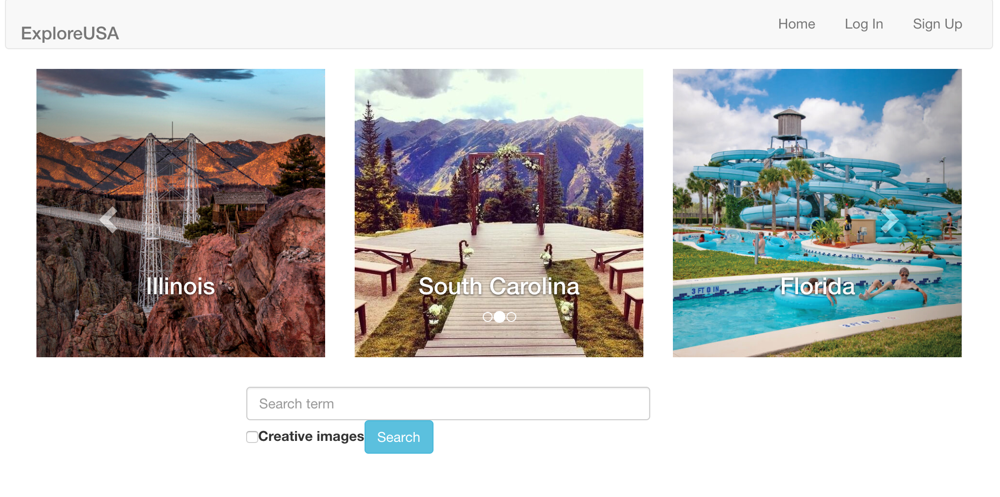
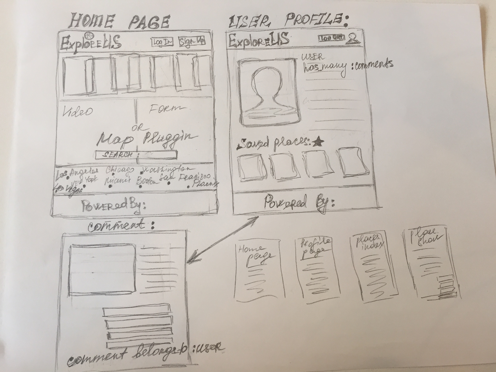
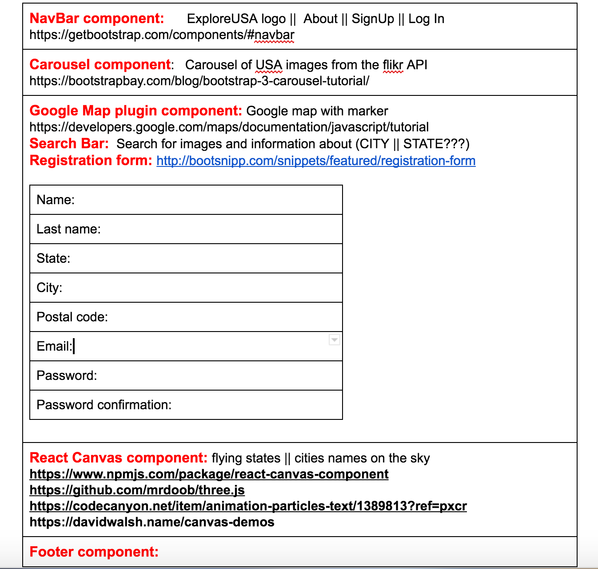
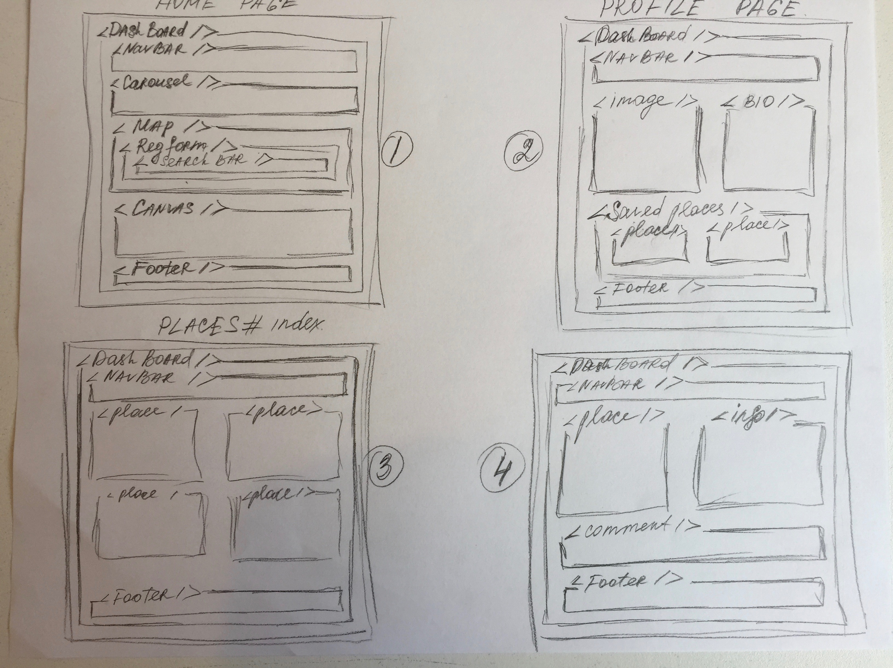

##ExploreUSA
* Explore-USA is an entertaining application that gives users the opportunity to find interesting images of places from the US. 
* It's a great choice when planning a trip to anywhere   in the states and look ahead at things that you are going to enjoy.
* Explore-USA is also an interactive library of great images from people around the world.
* Explore-USA connects to a third-party API which provides current images of the places you are looking for.
* It is a great application to find out more about hidden spots and latest news.

##Link website
[https://explore-usa.herokuapp.com/]()

##User Stories:
* As a user, I want to search for state, city or particular place in the US. Use a search bar for that purpose.
* As a user I am required to sign in or create a new account. (sign up)
* As a user after I am logged in I can go on to a search or map engines.
* As a user, after entering the key word to the search bar, I can see the list of the items (images with their information).
* As a user, when I click on the image from the list, a pop up window appears with the description of the place.
* As a user I have my profile page, where I want to be able to store places that I liked and consider to visit.
* As a user, I want to be able to comment on places that I've been to already, to help people make a right choice.

##Working Process 
* The working process started with brainstorming the ideas for the project using Trello.
* The whole week was about learning how to read the documentations, watching tutorials and videos.
* Learning to solve merge conflicts

##Future Development
* As a user I would want the design to be completed
* As a user I want to be able to comment on item
* As a user I want to have the user profile 
* As a user I want to be able to save items that I consider to go to
* As a user, I want to be able to search through the google maps.
* Find a better API for both images and information
* Add Canvas Flying Particles

##Technologies Used:
* HTML
* CSS/SCSS
* API
* Bootstrap, Bootswatch
* JavaScript
* React
* JQuery
* Ruby on Rails
* Heroku platform

##Installation instructions:
* Go to the project folder
* Run bundle install (all the necessary gems will be installed)
* Open the app with atom
* On a new tab run the server with the command rails s
* Go to port localhost:3000

##Presented by:
* Yanny Castrillon
* Nadia Kim
